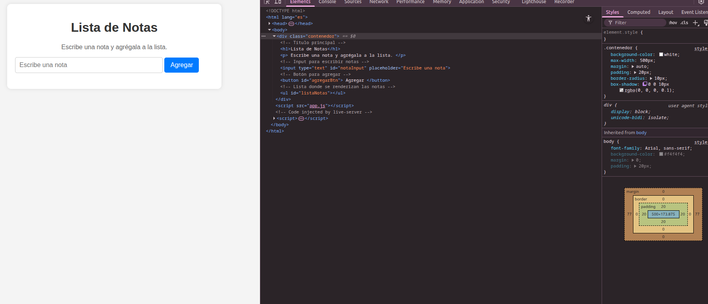
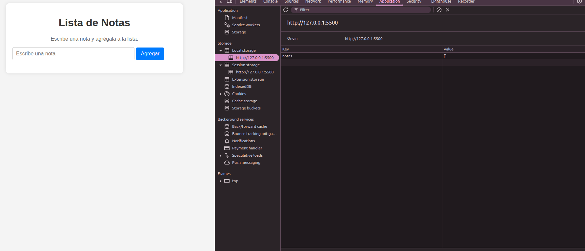
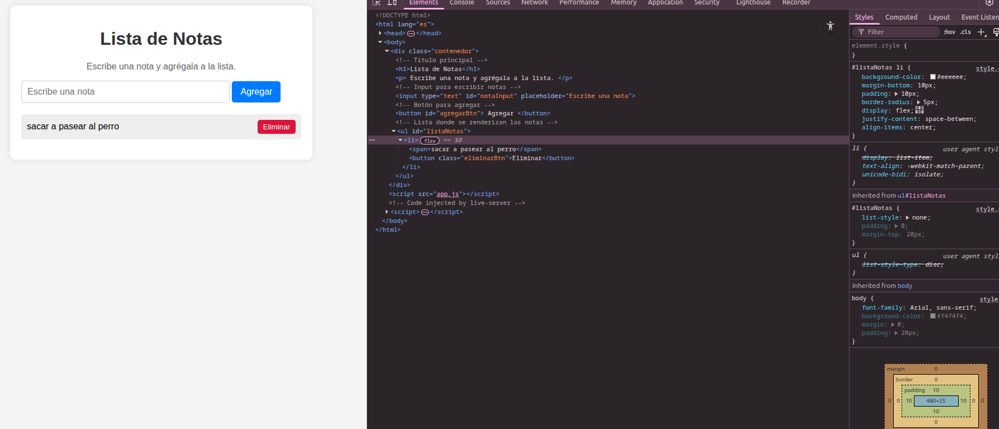
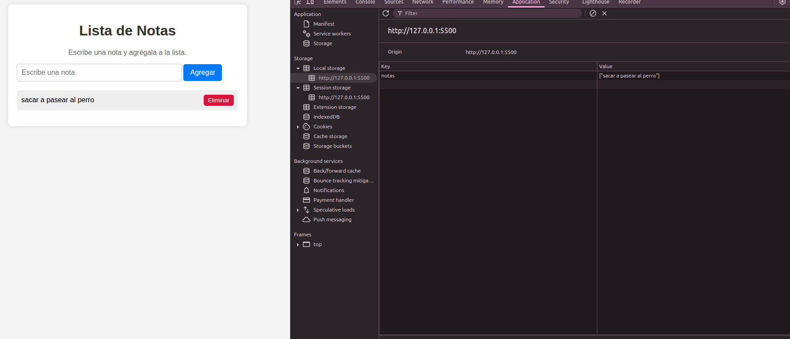
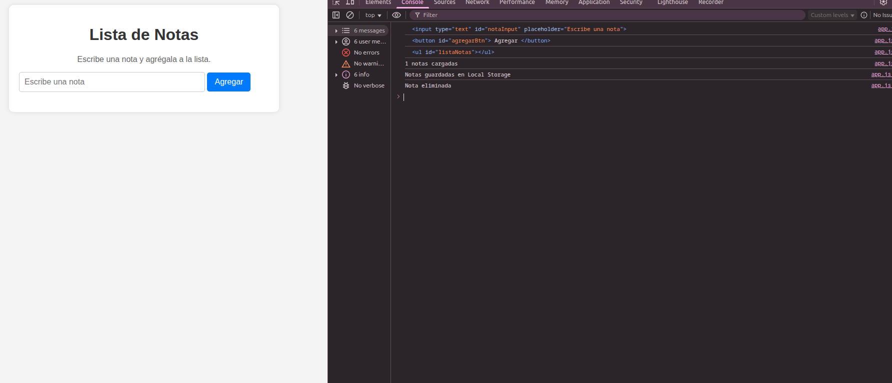

# Gestión Dinámica del DOM con Persistencia en el Navegador

## Descripción

Este proyecto consiste en una **mini-app de lista de notas** que permite:

- Agregar notas dinámicamente al DOM.
- Eliminar notas existentes.
- Guardar y recuperar notas usando **Local Storage**, de manera que las notas persistan tras recargar la página.

Es un ejemplo práctico de manipulación del DOM y almacenamiento en el navegador, cumpliendo con los objetivos de la **Historia de Usuario M3S3**.

---

## Tecnologías utilizadas

- HTML
- CSS
- JavaScript 
- Local Storage 

---

## Estructura del proyecto
```

.
├── index.html # Archivo principal HTML
├── style.css # Estilos de la aplicación
├── app.js # Lógica de la aplicación
└── README.md # Documentación del proyecto

```
---

##  Funcionalidades

1. **Agregar nota**
   - Se valida que el input no esté vacío.
   - Se crea un elemento `<li>` con el texto y un botón "Eliminar".
   - La nota se agrega al DOM y se guarda en Local Storage.
   - El input se limpia y el foco vuelve al campo de texto.

2. **Eliminar nota**
   - Al hacer click en "Eliminar", se remueve el `<li>` correspondiente.
   - Se actualiza el arreglo de notas y Local Storage.
   - Se imprime un mensaje en consola confirmando la eliminación.

3. **Persistencia**
   - Las notas se mantienen aunque se recargue la página.
   - Al cargar, se recuperan todas las notas guardadas en Local Storage.

4. **Consola**
   - Se muestran mensajes de:
     - Referencias a los elementos del DOM.
     - Cantidad de notas cargadas.
     - Agregados y eliminados.
     - Guardado en Local Storage.

---

##  Estilos

- Diseño simple y limpio.
- Lista de notas con botones de eliminar claramente visibles.
- Responsive y centrado en la página.
- Uso de flexbox para organizar texto y botones dentro de cada `<li>`.

---









##  Autor

- Leonardo Ayala