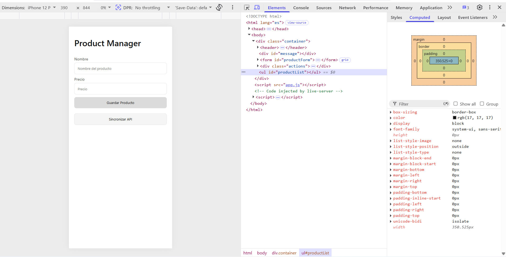
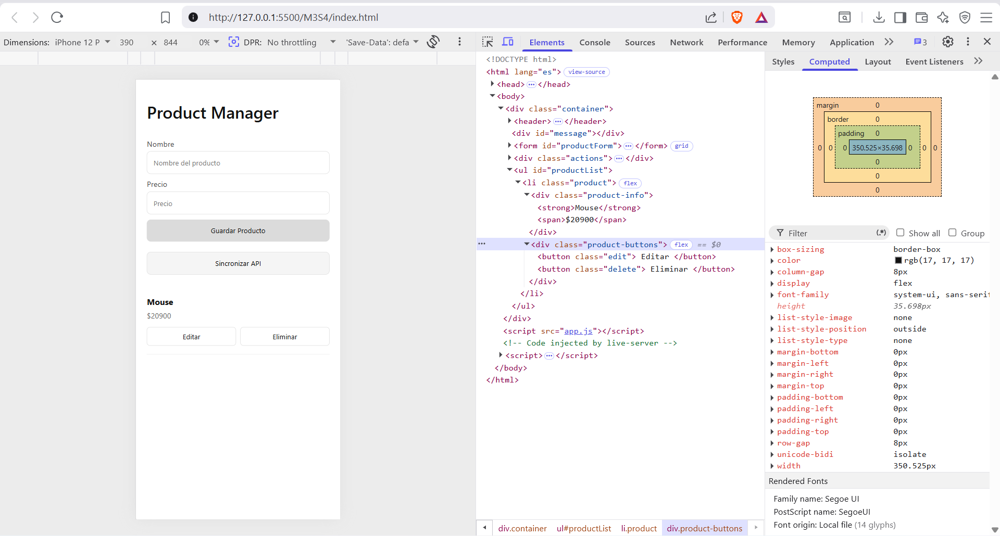
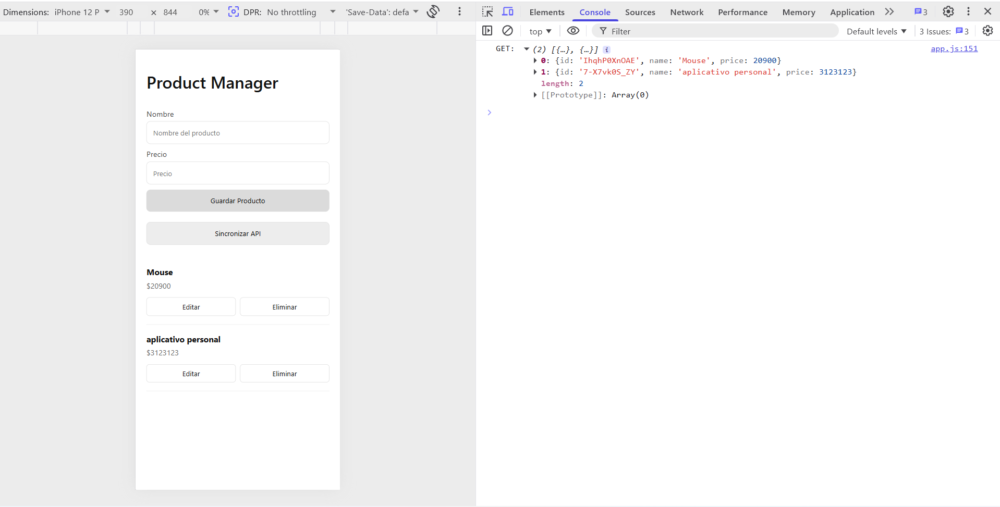
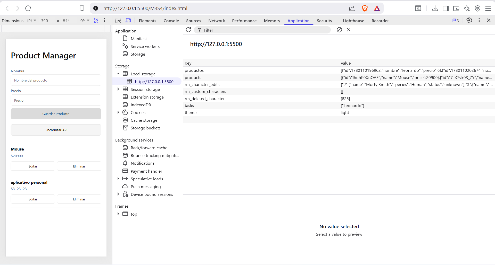
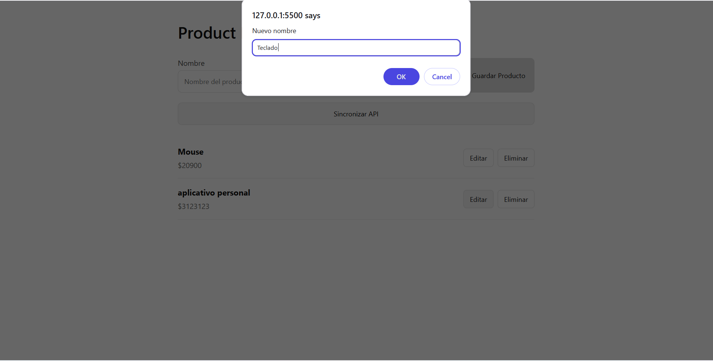
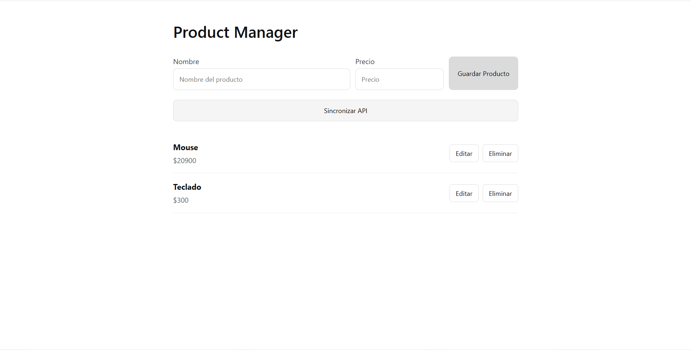

# Product Manager 

aplicación web desarrollada con JavaScript, Local Storage y Fetch API para gestionar productos de manera dinámica.

##  Características

- Agregar productos.
- Editar productos.
- Eliminar productos.
- Persistencia de datos con Local Storage.
- Sincronización con API mediante Fetch API.
- Operaciones CRUD completas.
- Validación de formularios.
- Diseño responsive y minimalista.

---

##  Tecnologías utilizadas

- HTML5
- CSS3
- JavaScript (ES6+)
- Local Storage
- Fetch API
- JSON Server

---

##  Estructura del proyecto

```text
├── index.html
├── styles.css
├── app.js
└── db.json
```

---

##  Instalación

### 1. Clonar repositorio

```bash
git clone https://github.com/tu-usuario/product-manager-pro.git
```

### 2. Entrar al proyecto


### 3. Instalar JSON Server

```bash
npm install -g json-server
```

### 4. Ejecutar servidor

```bash
json-server --watch db.json --port 3000
```

### 5. Abrir aplicación

Abrir el archivo `index.html` en el navegador.

---

## 🔗 API utilizada

Servidor local con JSON Server.

```text
http://localhost:3000/productos
```

Métodos implementados:

- GET
- POST
- PUT
- DELETE

---

##  Persistencia de datos

La aplicación almacena la información en:

- Local Storage del navegador.
- JSON Server para simulación de backend.

---

---

##  Evidencias requeridas

1. DOM antes y después de una operación.


2. Consola mostrando respuestas de la API.

3. Local Storage con datos almacenados.

4. Operaciones CRUD funcionando.


---

##  Autor
**Leonardo Iván Ayala Pérez**
